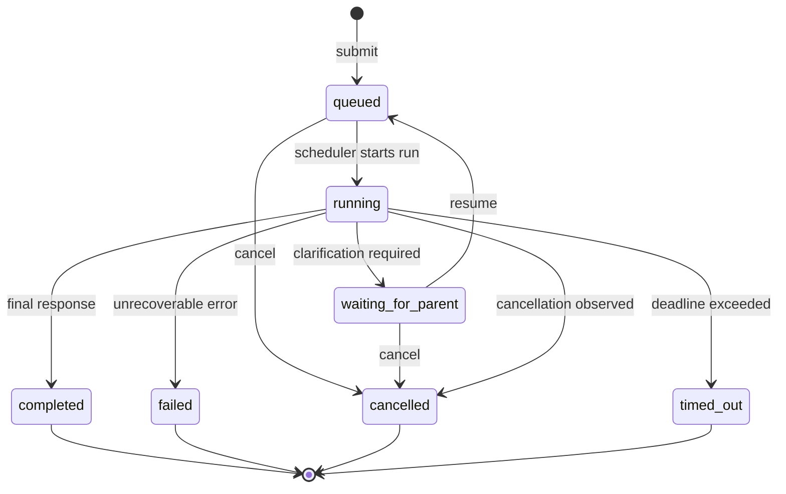
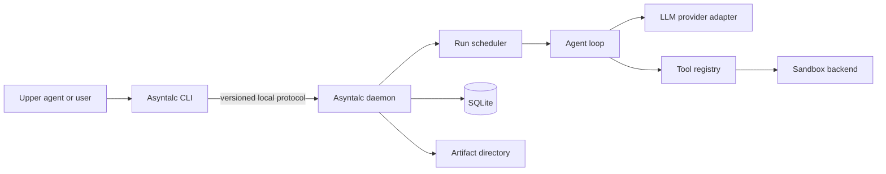

# Asyntalc Design, First Edition

Status: Draft v0.1  
Target implementation language: Rust  
Initial target platform: Linux  

## 1. Summary

Asyntalc is a durable asynchronous executor for LLM subagents.

A caller such as Codex, Claude, a shell script, or another orchestration system submits a task and immediately receives a durable `run_id`. The Asyntalc daemon owns the subagent's model calls, tool calls, persistence, cancellation, and sandbox. The caller may do other work and later wait for the run, inspect it, answer a question, or cancel it.

The central interaction is:

```text
submit -> run_id -> wait/status -> result
                         |
                         +-> waiting_for_parent -> resume -> result
```

Asyntalc uses one executable with two roles:

- A short-lived CLI client used by people and upper-level agents.
- A long-lived daemon that schedules and executes subagent runs.

The first edition is a local, single-machine system. It is not a distributed scheduler.

## 2. Motivation

A conventional CLI tool blocks until its work finishes. That behavior is convenient for a short operation, but an autonomous subagent may run for minutes, call several tools, wait for clarification, or survive the process that started it. Keeping one CLI invocation open makes concurrency depend on the upper agent framework and gives the caller little control over long-running work.

Asyntalc separates task submission from task completion. The upper agent does not need to understand the lower agent's entire conversation. It only needs a stable task contract:

- Has the run started?
- Is it still making progress?
- Does it need input from its parent?
- Did it succeed, fail, or get cancelled?
- What is the final result?

This makes a subagent resemble a durable future:

| Async runtime concept | Asyntalc concept |
|---|---|
| Task or future | Subagent run |
| Executor | Asyntalc daemon |
| Task handle | `run_id` |
| Spawn | `asyntalc submit` |
| Await | `asyntalc wait` |
| Inspect | `asyntalc status` |
| Cancellation | `asyntalc cancel` |
| Pending on external input | `waiting_for_parent` |
| Task output | Final subagent result |

Unlike an in-memory future, an Asyntalc run is persisted and can outlive its submitting client.

## 3. Goals

The first edition should:

1. Let an upper agent start a subagent without holding open a CLI process.
2. Return a durable handle that can be used by later processes.
3. Persist sessions, runs, messages, and lifecycle events in SQLite.
4. Execute independent sessions concurrently.
5. Serialize runs that mutate the same conversation session.
6. Expose explicit completion, failure, cancellation, timeout, and parent-input states.
7. Support one LLM provider well behind an interface that permits additional providers.
8. Execute a small set of tools through a replaceable sandbox interface.
9. Provide deterministic, machine-readable CLI output.
10. Recover into an understandable state after a daemon restart.

## 4. Non-goals for v0.1

The first edition will not attempt to provide:

- Distributed execution across multiple hosts.
- A general-purpose workflow language or dependency graph.
- Automatic delegation between arbitrary groups of agents.
- Transparent migration of a running model request between processes.
- Feature parity across every LLM provider.
- Perfect recovery of an interrupted side-effecting tool call.
- A security guarantee based only on the word "sandbox."
- A graphical interface.

These may be added after the task lifecycle and persistence model prove useful.

## 5. Core domain model

### 5.1 Session

A session contains persistent conversational context and configuration.

```rust
struct Session {
    id: SessionId,
    created_at: Timestamp,
    provider: ProviderConfig,
    system_prompt: String,
    state: SessionState,
}
```

One session has an ordered history. In v0.1, only one run may actively modify a session at a time. Later submissions to that session enter its FIFO queue.

Independent sessions may execute concurrently, subject to a daemon-wide concurrency limit.

### 5.2 Run

A run is one submitted unit of subagent work.

```rust
struct Run {
    id: RunId,
    session_id: SessionId,
    status: RunStatus,
    prompt: String,
    created_at: Timestamp,
    started_at: Option<Timestamp>,
    finished_at: Option<Timestamp>,
    result: Option<RunResult>,
}
```

The `run_id` is the durable task handle. It must be globally unique and safe to print, store, and pass through a shell.

### 5.3 Event

Every meaningful lifecycle transition is appended as an event. Events provide an audit trail, support streaming, and make failures diagnosable.

Example event kinds:

```text
session.created
run.submitted
run.started
message.user
message.assistant.delta
message.assistant.completed
tool.requested
tool.started
tool.completed
tool.failed
run.waiting_for_parent
run.resumed
run.completed
run.failed
run.cancelled
```

Large tool outputs may be stored as artifacts and referenced from events rather than embedded in every event row.

## 6. Run lifecycle



The externally visible statuses are:

```rust
enum RunStatus {
    Queued,
    Running,
    WaitingForParent,
    Completed,
    Failed,
    Cancelled,
    TimedOut,
}
```

`Completed`, `Failed`, `Cancelled`, and `TimedOut` are terminal states.

A run must never silently wait for information. When the subagent cannot continue without its parent, it transitions to `WaitingForParent` and records a structured request:

```json
{
  "kind": "question",
  "prompt": "Should I modify the existing database schema?",
  "choices": ["modify", "preserve"]
}
```

The parent supplies an answer with `asyntalc resume`. Resuming appends the answer to the conversation and returns the run to the session queue.

## 7. Caller interaction model

### 7.1 Asynchronous path

The primary interface starts a run and returns immediately:

```bash
asyntalc submit --session research-1 --input task.md --output json
```

```json
{
  "run_id": "run_01JQ...",
  "session_id": "research-1",
  "status": "queued"
}
```

The caller can perform independent work and later wait for a meaningful change:

```bash
asyntalc wait --run run_01JQ... --timeout 30s --output json
```

`wait` is server-side long polling. It returns when:

- The run reaches a terminal state.
- The run enters `waiting_for_parent`.
- The requested timeout expires.
- The client is interrupted.

A wait timeout does not cancel the run.

Example nonterminal response:

```json
{
  "run_id": "run_01JQ...",
  "status": "running",
  "phase": "tool_execution",
  "progress": "Running repository tests",
  "retry_after_ms": 30000
}
```

The caller should use `wait`, rather than asking the model to issue rapid repeated `status` calls.

### 7.2 Synchronous compatibility path

For short tasks and callers without durable-job support:

```bash
asyntalc send --session research-1 --input task.md
```

`send` is implemented as `submit` followed by `wait` until a terminal or `waiting_for_parent` state. The CLI process blocks, but the daemon and other sessions continue running.

### 7.3 Status, resume, and cancellation

```bash
asyntalc status --run run_01JQ... --output json
asyntalc resume --run run_01JQ... --input answer.md --output json
asyntalc cancel --run run_01JQ... --output json
```

`status` returns immediately. `resume` is valid only for a run waiting for its parent. `cancel` is idempotent: cancelling an already cancelled run succeeds, while a terminal successful or failed run remains unchanged.

### 7.4 Input and output rules

Prompts should be accepted from files or stdin. Large or multiline prompts should not normally be placed in `--content`, because shell quoting, process listings, and command-length limits make that interface fragile.

```bash
asyntalc submit --session research-1 --input - < task.md
```

For machine-readable operation:

- stdout contains only the requested JSON or JSONL protocol.
- stderr contains human diagnostics.
- Process exit codes distinguish command/protocol failure from a successfully queried run whose status is `failed`.
- Every response includes a protocol version.

For human operation, the default output may be concise text. Agent integrations should always request JSON.

## 8. Behavior expected from an upper agent

An upper agent should treat a run as an owned task handle:

1. Call `submit` and retain the returned `run_id`.
2. Start other independent runs or continue local work when useful.
3. Call `wait` when the result becomes necessary.
4. If the run requests parent input, decide or ask its own user and then call `resume`.
5. Integrate the terminal result into its own work.
6. Cancel runs that are no longer needed.

The upper agent is not expected to inspect every internal model message. The stable supervision surface consists of status, phase, a short progress summary, parent questions, usage, and the terminal result.

Suggested tool description for agent hosts:

> `submit` starts a subagent task and returns immediately. The task continues in the Asyntalc daemon. Retain its `run_id`, perform independent work when available, and call `wait` when the result is needed. Do not poll `status` repeatedly.

## 9. Architecture



### 9.1 One executable

The executable provides several subcommands:

```text
asyntalc daemon
asyntalc submit
asyntalc send
asyntalc wait
asyntalc status
asyntalc resume
asyntalc cancel
asyntalc logs
```

Client commands connect to the daemon through a Unix domain socket. If configured, a client may safely start a missing daemon and then reconnect. Only one daemon may own a given data directory.

Unix domain sockets are sufficient for the first Linux release. A later cross-platform transport can use named pipes on Windows.

### 9.2 Local protocol

The first protocol can be newline-delimited JSON over a Unix stream socket. Each request carries:

- Protocol version
- Request ID
- Operation
- Operation parameters

Each response echoes the request ID. Streaming operations produce zero or more event messages followed by exactly one terminal protocol response.

The protocol should remain private to the CLI and daemon in v0.1. Stability is provided at the CLI JSON boundary first.

### 9.3 Scheduler

The scheduler maintains:

- A FIFO queue for each session
- A daemon-wide maximum number of active runs
- At most one active run per session
- Cancellation tokens for active work
- Run deadlines and resource budgets

Fair scheduling across sessions can initially be round-robin. Priorities and dependency graphs are deferred.

## 10. Agent loop

The agent loop repeats until the provider returns a final answer or a limit is reached:

```text
load session context
append parent prompt
call provider
persist streamed response events
if response contains tool calls:
    validate calls
    execute allowed tools
    persist results
    continue
else:
    persist final response
    complete run
```

Every run has explicit budgets:

- Wall-clock deadline
- Maximum model turns
- Maximum tool calls
- Maximum model tokens or estimated cost, where available
- Maximum tool output captured in context

Budget exhaustion produces a typed failure or timeout rather than an indefinitely running task.

## 11. Provider abstraction

Asyntalc should own a small internal representation instead of exposing a provider's schema throughout the codebase.

The shared subset for v0.1 is:

- Text input and output
- System instructions
- Streaming text deltas
- Tool definitions
- Tool calls and tool results
- Provider finish reason
- Token usage when reported
- Cancellation

Provider-specific capabilities may be stored as optional metadata. The shared abstraction should not pretend that all providers have identical semantics.

The first release should implement one provider completely. Additional adapters can follow once the internal event model has survived real use.

## 12. Tools and sandboxing

### 12.1 Tool registry

Tools have a stable name, description, JSON input schema, execution policy, and typed result.

```rust
trait Tool {
    fn definition(&self) -> ToolDefinition;
    async fn execute(
        &self,
        context: ToolContext,
        arguments: serde_json::Value,
    ) -> Result<ToolOutput, ToolError>;
}
```

The initial tool set should stay small:

- Read a file within the mounted workspace
- List or search workspace files
- Execute an allowed command in the sandbox
- Report progress or request parent input

MCP support can later add external tools without expanding the core registry interface.

### 12.2 Sandbox interface

Sandboxing is a policy boundary, not merely a process-launch mechanism.

```rust
trait Sandbox {
    async fn execute(&self, request: ExecRequest) -> Result<ExecResult, SandboxError>;
    async fn cancel(&self, execution_id: ExecutionId) -> Result<(), SandboxError>;
}
```

The first practical backend may use Docker. Its policy must explicitly define:

- Image allowlist
- Read-only and writable mounts
- Network access
- Environment variables and secret handling
- CPU, memory, process, disk, and time limits
- Container user and host UID/GID mapping
- Linux capabilities and seccomp profile
- Output limits
- Cleanup after success, cancellation, or daemon restart

Provider credentials remain in the trusted daemon and should not be injected into tool containers. Access to the Docker daemon belongs to the trusted host boundary.

A local-process backend may exist for development, but it must be named and documented as unsandboxed.

## 13. Persistence and recovery

SQLite is the source of truth for sessions, runs, messages, and events. A transaction must persist a state transition and its corresponding event together.

Suggested initial tables:

```text
sessions
runs
messages
events
artifacts
```

Artifacts such as large command output can live under the daemon data directory, with hashes and metadata stored in SQLite.

On daemon startup:

1. Acquire exclusive ownership of the data directory.
2. Validate or migrate the database schema.
3. Inspect runs left in `running` state.
4. Clean up or account for their sandbox resources.
5. Mark them `failed` with reason `daemon_interrupted` in v0.1.
6. Continue queued runs.

Automatically replaying an interrupted tool call is unsafe because the original call may already have produced side effects. More advanced recovery requires idempotency keys or tool-specific reconciliation and is deferred.

## 14. Cancellation and timeouts

Cancellation is cooperative first and forceful after a grace period:

1. Persist `cancellation_requested`.
2. Signal the active provider request or tool execution.
3. Allow a short cleanup period.
4. Terminate the sandboxed process or container if necessary.
5. Persist the terminal `cancelled` state.

Disconnecting a CLI client does not cancel a run. The explicit `cancel` operation is required.

Every blocking client operation also accepts its own wait timeout. A client-side timeout affects only that client invocation; a run deadline affects the durable run.

## 15. Observability

Each run exposes:

- Current status and phase
- Creation, start, and finish timestamps
- Latest concise progress message
- Model and tool turn counts
- Token usage when available
- Terminal result or typed error
- Ordered event log

Progress is advisory. Correct orchestration relies on durable status transitions, not on whether an upper tool runner happens to display streamed console output.

Sensitive values must be redacted before events or tool output are persisted.

## 16. Configuration and trust boundaries

Configuration precedence should be explicit:

```text
CLI flags > environment variables > project configuration > user configuration > defaults
```

The daemon is trusted with provider credentials, session contents, and sandbox control. The subagent and its tool processes are less trusted. The local socket must be accessible only to the owning user by default.

The first release should state a narrow threat model: it aims to limit accidental or model-directed damage inside tool execution. It does not claim protection against kernel or container-runtime vulnerabilities.

## 17. Proposed Rust module layout

```text
src/
  main.rs
  cli.rs
  protocol.rs
  daemon.rs
  scheduler.rs
  agent/
    mod.rs
    loop.rs
    context.rs
  provider/
    mod.rs
    first_provider.rs
  tool/
    mod.rs
    filesystem.rs
    command.rs
    parent_input.rs
  sandbox/
    mod.rs
    docker.rs
    local.rs
  store/
    mod.rs
    sqlite.rs
    migrations.rs
  event.rs
  error.rs
```

This layout preserves clear boundaries without splitting the first edition into multiple crates prematurely.

## 18. First implementation milestone

The first useful vertical slice is complete when it can:

1. Start one daemon and connect through a Unix domain socket.
2. Create or reuse a session.
3. Submit a prompt and immediately return a `run_id`.
4. Execute the run through one real LLM provider.
5. Persist all lifecycle state in SQLite.
6. Wait for and retrieve a final response from another CLI process.
7. Run two independent sessions concurrently.
8. Queue two submissions to the same session in order.
9. Cancel an active run.
10. Surface one structured `waiting_for_parent` interaction and resume it.
11. Mark an interrupted active run clearly after daemon restart.

Tool execution and Docker isolation can then be added as the next vertical slice. This ordering tests the distinctive async-subagent interaction before spending most of the effort on sandbox policy.

## 19. Acceptance scenarios

### Concurrent research

```bash
asyntalc submit --session api-research --input api-task.md --output json
asyntalc submit --session storage-research --input storage-task.md --output json
```

Both runs may execute concurrently because they belong to different sessions.

### Ordered conversation

Two tasks submitted to `api-research` are executed in submission order. The second sees the committed conversation output of the first.

### Parent clarification

A run that cannot choose safely enters `waiting_for_parent`. `asyntalc wait` returns the question. After `asyntalc resume`, the same run continues with the parent's answer.

### Client interruption

The user interrupts `asyntalc wait`. The durable run continues. A later invocation can wait on the same `run_id`.

### Daemon interruption

The daemon stops during a tool call. On restart, Asyntalc does not silently replay the call. It records an interrupted failure and reports it to the parent.

## 20. Open design questions

The implementation should answer these through small experiments:

1. Should a resumed `waiting_for_parent` operation retain its `run_id`, as proposed here, or create a child run?
2. Should session creation be explicit, or should `submit` create a missing named session?
3. Which provider should define the first complete vertical slice?
4. Should JSONL event streaming be part of v0.1, or should `wait` return snapshots only?
5. Which Docker network policy is useful by default for coding subagents?
6. How should workspace changes from concurrent sessions be isolated: separate directories, Git worktrees, or caller-managed paths?
7. When should old events and artifacts be compacted or removed?
8. Which operations should require an explicit parent approval policy?

## 21. Design principle

Asyntalc should make waiting explicit and durable.

The upper agent should never need to infer whether a lower agent is still thinking, stuck in a tool, waiting for permission, or finished. The daemon converts that complicated internal conversation into a small observable lifecycle while preserving the detailed event history for debugging.
