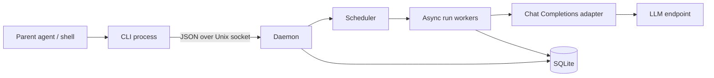
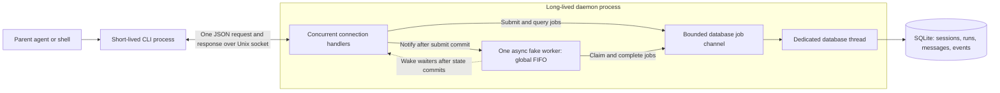
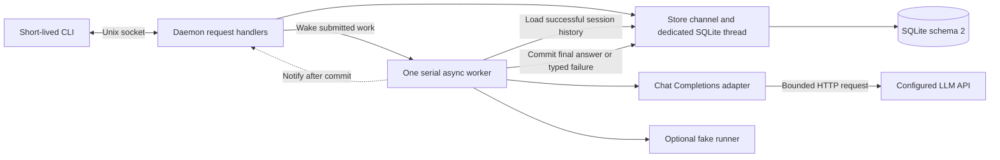
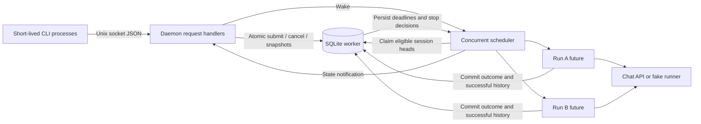

# Asyntalc prototype plan

Status: Milestones 1–2 implemented; one-request live DeepSeek validation passed. Version 0.1.1, updated 2026-09-19.
Based on [the v0.1 design](asyntalc-design-v0.1.md).
Provider decision: an OpenAI-compatible Chat Completions API, with configurable endpoint and model.

**Current verdict:** version 0.1.2 implements durable submission/retrieval, real Chat requests, successful conversation history, independent-session concurrency, per-session FIFO, cancellation, run deadlines, and submission idempotency. The CLI now validates the concurrent execution portion of v0.1. Parent questions/resume and operational list/log commands remain. See [section 13](#13-milestone-3-concurrent-durable-execution) for the current architecture, usage, and validation. Sections 10–12 retain historical milestone exhibitions.

Sections 1–9 describe the target prototype, including work that remains unimplemented. The provider adapter now exists; the separate concurrent scheduler remains planned.

The first prototype should prove that a parent can submit several tasks, exit, and later retrieve durable results. Build one Rust binary with a short-lived client and a separately started daemon. Add parent clarification after the basic request lifecycle works; add workspace tools and isolation afterward.

The parent owns decomposition, dependencies, and synthesis. The daemon owns execution, concurrency, conversation state, and recovery. This is enough to support a parent-managed swarm without implementing an autonomous swarm planner.

## 1. Review decisions

The existing design has the right boundaries. Resolve these details before implementation:

| Topic | Prototype decision |
|---|---|
| Durability | Acknowledge submission only after committing the run and event to SQLite. |
| Session creation | `submit` creates a missing named session atomically; omitting `--session` creates an independent session. Return its ID. |
| Existing session configuration | Reuse its stored model/profile; reject conflicting overrides rather than silently changing its context. |
| Conversation ordering | Persist prompts at submission, but add them to model context only when their run starts. Future queued prompts must not leak into earlier runs. |
| Waiting for parent | Retain the session's head run, release the global execution slot, and block later runs in that session. |
| Resume | Keep the same run ID and original FIFO position. Require a question ID so stale answers cannot resume a newer question. |
| Completion | Means the executor obtained a valid final answer; it does not prove that the answer is correct or the user's objective is met. |
| Client output | Versioned JSON receipts and snapshots; detailed conversation history is opt-in. |
| Daemon startup | Explicit foreground `daemon` command initially. Defer automatic launch and service installation. |
| Restart | Recover queued and waiting runs; fail previously running runs with `daemon_interrupted`. Do not automatically replay their API requests. |
| Streaming | Start with non-streaming provider responses and snapshot waits. Async execution does not require token streaming. |
| Workspace | No file or command tools in the initial slice. Later, require a caller-supplied workspace per session. |

## 2. Scope and architecture



The CLI reads input, sends one request, prints a response, and exits. It never calls the model directly. Separate CLI invocations share the daemon's durable state.

Use a single crate. Suggested modules: `cli`, `protocol`, `daemon`, `scheduler`, `store`, `provider`, `runner`, and `error`. Add `tool` and `sandbox` only when those slices begin.

Use Tokio for socket handling and concurrent model requests. Keep scheduler ownership in one task with bounded messages; avoid holding shared locks across network waits. Tokio documents this resource-owner/channel pattern in its [channel tutorial](https://tokio.rs/tokio/tutorial/channels).

Keep SQLite access behind a store interface and a dedicated database worker if using a synchronous driver. Keep transactions short and never hold one open during an LLM request. WAL can support concurrent readers, but SQLite still permits only one writer, as described in its [transaction documentation](https://www.sqlite.org/lang_transaction.html) and [WAL documentation](https://www.sqlite.org/wal.html).

Use one OS-level exclusive lock per data directory, a private socket accessible to its owner, bounded request frames, and bounded queues. Reject excess submissions with a typed capacity error. Configure input, response, history, and event-size limits from the beginning.

## 3. CLI workflow

The examples below specify the target CLI, not the current executable's exact syntax. The current binary accepts `daemon --config FILE` or `daemon --runner fake` and uses `wait --timeout-ms 20000`; it accepts `cancel --run ID` but does not accept `--timeout` or `resume`. Use section 13 for current scheduling behavior, section 10 for the historical fake exhibition, and section 12 for provider setup.

```bash
# Terminal 1: daemon owns API credentials and provider configuration.
asyntalc daemon --config daemon.toml

# Terminal 2: each submission returns after its database commit.
asyntalc submit --session api-review --input api-task.md --output json
asyntalc submit --session storage-review --input storage-task.md --output json

# Inspect immediately or wait for a useful outcome.
asyntalc status --run run_a --output json
asyntalc wait --run run_a --timeout 20s --output json
asyntalc result --run run_a --output text

# Parent interaction, introduced in milestone 4.
asyntalc resume --run run_a --question q_1 --input answer.md --output json
asyntalc cancel --run run_a --output json
```

Support stdin through `--input -`. Make JSON the prototype default; `--output text` is explicit. Diagnostics belong on stderr. Use the existing document's `asyntalc` spelling consistently until a separate naming decision is made.

`wait` blocks only the invocation that calls it, for a bounded time. The daemon continues eligible work. Even a host that invokes CLI tools sequentially can submit A, submit B, do local work, and then wait. In the target scheduler A and B can execute concurrently; in milestone 1 they execute serially while the parent remains free between client invocations. The host must choose when to wait—this executable cannot force the parent model to continue reasoning while its host blocks on a tool.

Add `runs list --status ...` with pagination to rediscover handles after a parent restart. Add `logs --run ... --after-seq ... --limit ...` for finite event retrieval. Defer live JSONL streaming and `send` convenience mode until the core works.

For larger swarms, the next interface extension should be bounded `wait --any --runs ...`, so one slow run does not delay noticing another run's question or completion. It is not required for the first two-run demonstration.

## 4. What the async client returns

Return an executor-created envelope. The model supplies answer text and tool arguments; it never controls IDs, lifecycle state, command success, or reported execution facts.

### Submission receipt

```json
{
  "protocol_version": 1,
  "request_id": "req_1",
  "ok": true,
  "run_id": "run_a",
  "session_id": "api-review",
  "status": "queued",
  "revision": 1
}
```

This is a committed acceptance receipt, not an LLM response. It must not wait for a provider connection. `queued` describes the committed receipt; the scheduler may already have started execution when the caller reads it.

### Wait/status snapshot

```json
{
  "protocol_version": 1,
  "request_id": "req_2",
  "ok": true,
  "run_id": "run_a",
  "session_id": "api-review",
  "status": "running",
  "revision": 2,
  "return_reason": "wait_timeout",
  "phase": "model_request",
  "progress": null,
  "cancellation_requested": false,
  "blocked_by_run_id": null,
  "created_at": "2026-09-19T03:00:00Z",
  "started_at": "2026-09-19T03:00:01Z",
  "finished_at": null,
  "result": null,
  "input_request": null,
  "run_error": null,
  "usage": {"model_requests": 1, "input_tokens": null, "output_tokens": null}
}
```

`return_reason` describes why this command returned: `snapshot`, `terminal`, `input_required`, or `wait_timeout`. It is separate from durable run status. A timeout here leaves the run unchanged.

`revision` increases on observable durable changes. Progress is optional and advisory: without streaming or tools, the daemon knows only that an API request is in flight. Do not invent percentages or claim the model is reasoning or making progress.

`status` omits answer bodies by default; `wait` includes a bounded final answer on terminal return. Both include `result` metadata if a result exists. `result --output text` retrieves the full stored answer; before completion it returns `result_not_ready`.

### Terminal result

On completion, the same snapshot has `status: "completed"`, `return_reason: "terminal"`, a finish timestamp, and:

```json
{
  "result": {
    "format": "text",
    "text": "Use one FIFO queue per session and allow independent sessions to run concurrently.",
    "truncated": false,
    "full_result_available": true,
    "finish_reason": "stop"
  },
  "input_request": null,
  "run_error": null
}
```

Initially store the full bounded provider answer in SQLite. Limit inline answer text to a proposed 16 KiB UTF-8-safe prefix; set `truncated: true` when shortened. The full answer remains accessible using the run ID. Cap total provider response size independently and fail explicitly if exceeded. Add artifact references when file/tool output exists.

Return the useful final answer, not every internal conversation message. A second model call just to summarize the result is unnecessary. If a task asks for findings, evidence, and limitations, request those in its prompt; they remain model-authored claims, not executor guarantees. Schema-validated structured task results can be an optional later feature.

### Parent input

For `waiting_for_parent`, return `return_reason: "input_required"` and:

```json
{
  "input_request": {
    "question_id": "q_1",
    "kind": "question",
    "prompt": "Should this proposal preserve the existing public CLI?",
    "choices": ["preserve", "redesign"],
    "allows_free_text": true
  }
}
```

The question ID belongs to the daemon. Resume validates that ID and stores the answer atomically before making the same run eligible again. Repeating the identical answer to the same question returns the prior acknowledgement; a different answer conflicts. A clarification response is not a general authorization mechanism for future privileged tools.

### Failures and exit codes

A successfully queried failed run has `ok: true`, `status: "failed"`, and a typed `run_error`, for example `{"code":"provider_auth_error","message":"Provider rejected authentication"}`. Keep partial text, if any, explicitly separate from the final result.

A command failure has `ok: false` and `error`, for example `{"code":"run_not_found","message":"Unknown run ID"}`. Do not expose API keys or raw provider headers/bodies in errors.

Use exit code 0 for valid receipts and snapshots, including failed runs, input requests, and wait timeouts. Use 2 for invalid CLI arguments and 1 for transport/protocol/command errors. Scripts inspect `status` for task success. Client interruption exits nonzero without cancelling the run. This keeps command execution distinct from task execution.

## 5. OpenAI-compatible adapter

Define a provider profile containing an API base URL (including its version prefix), model, API-key environment variable name, request timeout, instruction role, and supported capabilities. Append `/chat/completions` once. Resolve credentials inside the daemon; persist only the profile reference and non-secret effective configuration.

Implement a small HTTP adapter using `model`, `messages`, and `stream: false`; request one choice. Decode assistant text, tool calls, finish reason, and optional usage. Chat Completions represents function calls on assistant messages and returns tool results using the matching `tool_call_id`. See the [official Chat API reference](https://developers.openai.com/api/reference/resources/chat).

Treat this as an explicit compatibility profile, not a promise that every similarly named API works identically. Avoid sending optional fields indiscriminately. Output-token parameter names, instruction roles, tool support, usage, and optional fields must be configurable or verified against the chosen endpoint. Text-only operation should work without function calling.

For the prototype, map a valid final text answer with `stop` to completion. Map `length` to `output_limit`, filtered/refused output to a typed unsuccessful outcome, malformed responses to `provider_protocol_error`, and unsupported tool calls to `unsupported_capability`. Preserve the provider finish reason. Never interpret HTTP 200 alone as task completion.

Use a fake HTTP provider for deterministic tests and one explicit live smoke test against a user-configured model. No credentials are needed for normal tests. Keep automatic API retries off initially; ambiguous network failures become visible failures rather than hidden duplicate calls. Parent retry is an explicit new run. Local submission deduplication does not imply provider-side exactly-once execution.

Later streaming is an adapter enhancement; it must not change the CLI lifecycle contract.

## 6. Durable scheduler rules

Use four initial tables: `sessions`, `runs`, `messages`, and `events`. Add artifacts only when needed. Store input, immutable session queue position, status/revision, timestamps, deadline, result/error, cancellation request, pending question, and optional submission idempotency key on each run. Give messages stable ordering and distinguish run-local history from history committed for future runs.

Each state transition, revision increment, and corresponding event belongs in one transaction. Use a monotonic per-run event sequence for paginated logs. Publish in-memory notifications only after commit; notifications are hints, SQLite is authoritative.

Submission with `--idempotency-key` deduplicates within the daemon data directory. Persist the key, request fingerprint, and original receipt in the submission transaction. The same key and payload return that receipt; a changed payload returns a conflict. Keep the key while retaining the run. A parent uncertain whether submission succeeded can retry safely using the same key.

Schedule the earliest nonterminal run per session, subject to a configurable global active-run limit. Default to two workers for the demonstration and round-robin eligible sessions. A waiting head run blocks its own session, not other sessions. Return its ID as `blocked_by_run_id` on queued snapshots.

Maintain run-local messages during execution and clarification. Commit their conversation segment to the session only on successful completion. Failed/cancelled/timed-out runs retain their audit history but do not append incomplete tool-call sequences to later model context. Subsequent runs see the last successfully committed context. Document this policy; explicit retry can include useful partial information.

Implement `wait` as subscribe, read durable snapshot, evaluate, then await notification and re-read until terminal/input-required/timeout. This avoids a completion lost between inspection and subscription. Do not hold a database transaction or worker permit while long-polling. Multiple waiters must work independently.

Persist an absolute run deadline, proposed default 10 minutes from submission. It includes queue and parent-input time, and is distinct from the HTTP request timeout and client wait timeout. Check expired deadlines in all nonterminal states, including during startup. Extend the original lifecycle diagram with `queued -> timed_out` and `waiting_for_parent -> timed_out`.

For cancellation, atomically record the request and notify the worker. Queued/waiting runs can become cancelled immediately. Active workers drop the local HTTP future and finish cleanup; remote generation or billing may continue. A completion commit and cancellation request must be serialized: if completion commits first, cancel returns the unchanged terminal state; if cancellation commits first, discard a late completion and terminalize cancellation. Use the same single-winner discipline for deadlines.

On restart, keep queued and unexpired waiting runs, finalize persisted cancellation requests, and fail other previously running runs with `daemon_interrupted`. Successful committed results remain successful even if their original CLI never received a reply. The ownership lock prevents a second scheduler from running against the same directory.

## 7. Parent clarification without a sandbox

After the text-only slice, expose one control tool: `ask_parent({prompt, choices?})`. Validate arguments, persist the assistant tool call and question, and suspend the run. On resume, append the parent's answer as that call's tool result before requesting another model turn. This follows the tool-call/result relationship in the [official function-calling guide](https://developers.openai.com/api/docs/guides/function-calling).

Require tool-call support only for this milestone. Ask for one tool call per turn where supported and enforce the constraint locally; reject multiple calls explicitly in this prototype. Do not infer suspension by parsing ordinary prose that ends in a question mark.

Bound model turns, question count, context size, and output size. Fail with typed limit errors when exhausted. Initially reject oversized conversation context rather than silently summarizing or dropping earlier messages.

## 8. Implementation milestones and acceptance tests

| Milestone | Deliverable | Acceptance evidence |
|---|---|---|
| 1. Client/daemon contract | Socket framing, CLI JSON, exclusive daemon ownership, SQLite migrations, fake runner | Another process retrieves a committed run; duplicate daemon refused; malformed/oversized request rejected; stdout parses as JSON. |
| 2. Real text requests | Configurable Chat adapter, result persistence, status/wait/result | Fake HTTP contract tests plus one live smoke request; closing submit client does not stop work; another CLI retrieves the exact final text. |
| 3. Concurrent durable execution | Session FIFO, global limit, idempotency, cancellation, deadlines, restart | Two sessions overlap; same-session runs do not overlap or see future input; ambiguous submit retry deduplicates; cancellation/deadline wins cannot be overwritten. |
| 4. Parent interaction | `ask_parent`, resume, persisted questions | Wait returns a question; waiting A1 blocks A2 while B runs; restart retains question; answer resumes A1; duplicate/stale answers are handled deterministically. |
| 5. Operable prototype | Paginated list/logs, bounded output, failure documentation, end-to-end demo | Multiple waiters and timeout/completion races pass; queued work recovers; running work fails visibly after kill/restart; completed results survive a lost reply. |

Use deterministic barriers and a delayed fake provider to test concurrency rather than relying on wall-clock timing alone. Include authentication errors, rate limits, malformed JSON, missing usage, output truncation, provider disconnect, and context limits in adapter tests. Check that unavailable token usage remains `null`, not a misleading zero.

For one developer comfortable with async Rust, a rough planning allowance is 2–4 focused days for milestones 1–2 and another 4–8 days for milestones 3–5. This is an estimate, not a delivery promise; provider quirks and crash/race handling dominate uncertainty. Tool execution and Docker are a separate estimate and milestone.

## 9. What follows the prototype

Add workspace reads and search, then sandboxed commands with explicit policies, output limits, process cleanup, and tests of the actual isolation boundary. Keep credentials in the daemon. Concurrent coding sessions need caller-managed separate directories or worktrees before shared-file mutation is enabled.

Then consider wait-any, structured result schemas, provider streaming, additional adapters, artifacts, and retention. Defer automatic delegation, DAG scheduling, multi-host operation, MCP integration, and transparent interrupted-request replay until the basic lifecycle has proven useful.

The first end-to-end demonstration is: submit A and B, exit both clients, observe concurrent execution, receive and answer a question from A, collect both final answers, and verify that a daemon interruption produces explicit recoverable state rather than silent duplication.

That is the target demonstration after the remaining milestones. The current demonstration below establishes the smaller milestone 1 contract.

## 10. Implemented architecture and runnable exhibition

Historical baseline: this section describes milestone 1 at commit `69c96ff`. Its fake-runner commands remain supported. See section 12 for the version 0.1.1 provider path and session-history behavior.

### What actually runs today



There is one executable with two roles, not a daemon spawned on every invocation. Start the daemon once; each `submit`, `status`, `wait`, or `result` launches a separate client process. The shell's `&` in the demonstration backgrounds the long-lived daemon. It is not needed for `submit` to return before its run finishes.

| Implemented module | Responsibility |
|---|---|
| [`src/cli.rs`](../src/cli.rs) | Parse arguments, read file/stdin input, connect, validate response IDs/version, print JSON or result text, exit. |
| [`src/protocol.rs`](../src/protocol.rs) | Versioned request/response envelopes, newline framing, and frame/input/wait limits. |
| [`src/daemon.rs`](../src/daemon.rs) | Own the directory lock and private socket, handle clients concurrently, run the serial fake worker, and wake bounded waits. |
| [`src/store.rs`](../src/store.rs) | Own SQLite on a dedicated thread; transact submissions, claims, completions, events, and startup recovery. |
| [`migrations/001_initial.sql`](../migrations/001_initial.sql) | Schema version 1 and the four persistent tables. |

A submission commits a queued run and its event before returning its receipt. The fake worker independently claims the oldest queued run, waits for the configured delay, and commits `[fake] <input>` plus two messages and a completion event. Waiters subscribe before reading state and re-read SQLite after notifications; the database remains authoritative.

**Concurrency has two meanings here.** Client requests and waiting connections can coexist. Task execution is still limited to one worker across every session. A reused session ID groups persisted records, but the fake worker does not read previous messages or maintain model conversational context.

### Copy-and-run demonstration

Run this Bash block from the repository root. It requires the Rust build prerequisites and Python 3's standard library for JSON parsing/assertions, but no API key. It uses an isolated directory and explicitly selects one execution slot to reproduce the milestone 1 baseline, verifies both answers and serial execution, and leaves JSON evidence plus SQLite there for inspection. A trap stops only the daemon launched by this example.

```bash
set -euo pipefail
cargo build --locked
demo_bin="$PWD/target/debug/asyntalc"
demo_dir="$(mktemp -d /tmp/asyntalc-demo.XXXXXX)"

start_demo_daemon() {
  "$demo_bin" --data-dir "$demo_dir" daemon --runner fake --max-active-runs 1 --fake-delay-ms 3000 \
    >"$demo_dir/daemon.stdout" 2>"$demo_dir/daemon.stderr" &
  demo_pid=$!
  for attempt in {1..50}; do
    if "$demo_bin" --data-dir "$demo_dir" ping >/dev/null 2>/dev/null; then
      return 0
    fi
    sleep 0.1
  done
  cat "$demo_dir/daemon.stderr" >&2
  return 1
}
trap 'kill "$demo_pid" 2>/dev/null || true; wait "$demo_pid" 2>/dev/null || true' EXIT
start_demo_daemon

# Each submitting client exits while the daemon retains its work.
printf 'Review API design' | "$demo_bin" --data-dir "$demo_dir" submit \
  --session api-review --input - >"$demo_dir/submit-a.json"
printf 'Review storage design' | "$demo_bin" --data-dir "$demo_dir" submit \
  --session storage-review --input - >"$demo_dir/submit-b.json"
run_a="$(python3 -c 'import json,sys; print(json.load(open(sys.argv[1]))["run_id"])' "$demo_dir/submit-a.json")"
run_b="$(python3 -c 'import json,sys; print(json.load(open(sys.argv[1]))["run_id"])' "$demo_dir/submit-b.json")"

# A zero-duration wait takes a snapshot; it does not cancel work.
"$demo_bin" --data-dir "$demo_dir" wait --run "$run_a" --timeout-ms 0 \
  >"$demo_dir/pending-a.json"
"$demo_bin" --data-dir "$demo_dir" status --run "$run_b" >"$demo_dir/status-b.json"
echo 'Parent is free to do local work between CLI calls.'

# Wait only when the answers are needed.
"$demo_bin" --data-dir "$demo_dir" wait --run "$run_a" --timeout-ms 10000 \
  >"$demo_dir/completed-a.json"
"$demo_bin" --data-dir "$demo_dir" wait --run "$run_b" --timeout-ms 10000 \
  >"$demo_dir/completed-b.json"
"$demo_bin" --data-dir "$demo_dir" result --run "$run_a" --output text >"$demo_dir/answer.txt"

# Restart the daemon; the answer must remain byte-for-byte identical.
kill "$demo_pid"
wait "$demo_pid"
start_demo_daemon
"$demo_bin" --data-dir "$demo_dir" result --run "$run_a" --output text >"$demo_dir/answer-after-restart.txt"
cmp "$demo_dir/answer.txt" "$demo_dir/answer-after-restart.txt"

python3 - "$demo_dir" <<'PY'
import json, pathlib, sqlite3, sys
root = pathlib.Path(sys.argv[1])
def load(name):
    return json.loads((root / name).read_text())
a, b = load('completed-a.json'), load('completed-b.json')
for name in ('submit-a.json', 'submit-b.json'):
    receipt = load(name)
    assert receipt['ok'] and receipt['status'] == 'queued'
for result, expected in ((a, '[fake] Review API design'), (b, '[fake] Review storage design')):
    assert result['ok'] and result['status'] == 'completed'
    assert result['return_reason'] == 'terminal'
    assert result['result']['text'] == expected
assert b['started_at_ms'] >= a['finished_at_ms'], 'milestone 1 executes serially'
with sqlite3.connect(root / 'state.sqlite3') as db:
    counts = {table: db.execute(f'SELECT count(*) FROM {table}').fetchone()[0]
              for table in ('sessions', 'runs', 'messages', 'events')}
assert counts == {'sessions': 2, 'runs': 2, 'messages': 4, 'events': 6}
print(json.dumps({'validated': True, 'counts': counts,
    'initial_a': load('pending-a.json')['status'],
    'initial_wait_reason': load('pending-a.json')['return_reason'],
    'initial_b': load('status-b.json')['status'],
    'a_execution_ms': a['finished_at_ms'] - a['started_at_ms'],
    'b_execution_ms': b['finished_at_ms'] - b['started_at_ms']}, indent=2))
print(f'Evidence retained at {root}')
PY
```

Usually the initial snapshots show A as `running` with `return_reason: "wait_timeout"`, and B as `queued`, despite their different sessions. A heavily delayed shell might inspect them after completion; the validation therefore uses persisted start/finish ordering, not an assumed observation time. Both submit receipts describe acceptance as `queued` regardless of a later state change.

### What the parent receives

Below are representative response excerpts from the demonstration, with IDs shortened and timestamp fields omitted. Actual commands return the complete envelopes; the evidence files above retain them.

```json
{
  "protocol_version": 1,
  "request_id": "req_submit_a",
  "ok": true,
  "run_id": "run_a",
  "session_id": "api-review",
  "status": "queued",
  "revision": 1
}
```

```json
{
  "protocol_version": 1,
  "request_id": "req_wait_a",
  "ok": true,
  "run_id": "run_a",
  "session_id": "api-review",
  "status": "running",
  "revision": 2,
  "phase": "fake_execution",
  "return_reason": "wait_timeout",
  "result": null,
  "run_error": null
}
```

```json
{
  "protocol_version": 1,
  "request_id": "req_completed_a",
  "ok": true,
  "run_id": "run_a",
  "session_id": "api-review",
  "status": "completed",
  "revision": 3,
  "phase": "finished",
  "return_reason": "terminal",
  "result": {
    "format": "text",
    "text": "[fake] Review API design",
    "truncated": false,
    "full_result_available": true,
    "finish_reason": "stop"
  },
  "run_error": null
}
```

`ok` describes the CLI operation; `status` describes the durable task. A wait timeout is a successful query and exits 0. Querying an interrupted run also exits 0, with `status: "failed"` and `run_error.code: "daemon_interrupted"`. An unknown run returns `ok: false`, `error.code: "run_not_found"`, and exit code 1. Invalid CLI arguments exit 2.

Current snapshots use Unix milliseconds (`created_at_ms`, `started_at_ms`, `finished_at_ms`). They do not yet contain the target contract's usage, parent question, progress, cancellation, or blocking-run fields. `status` omits answer text; `wait` includes up to 16 KiB with an explicit truncation flag; `result` retrieves full text. The fake runner's `finish_reason: "stop"` is a placeholder, not evidence of an LLM response.

## 11. Validation against the v0.1 design

This table records the milestone 1 assessment. The provider and conversation-history rows are superseded by section 12; the original observed measurements below remain unchanged.

The key hypothesis is that task lifetime belongs to the daemon rather than the submitting CLI. A blocking client would remain alive until its answer was available; this implementation returns a committed handle, permits intervening parent work, and lets a different client retrieve the result. The demonstration verifies process separation and persistence, not LLM capability or performance.

The following comparison refers to the original design's sections 7, 18, and 19. Its section 18 calls the entire first useful vertical slice a milestone; that is broader than milestone 1 of this implementation plan.

| v0.1 behavior | Current result | Evidence or missing work |
|---|---|---|
| One binary, short-lived CLI, long-lived daemon | Implemented | Demonstration uses separate client processes against one socket. |
| Durable handle returned before task completion | Implemented | Submission commits before acknowledging; demonstration captures a nonterminal snapshot after the submit client exits. |
| Create/reuse sessions | Partly implemented | Session records and IDs exist. No provider configuration or context replay yet. |
| One real LLM provider | Not implemented | Fake echo only; milestone 2. |
| Persist sessions, runs, messages, lifecycle events | Implemented for the fake lifecycle | Demonstration checks 2 sessions, 2 runs, 4 messages, and 6 events. |
| Retrieve an answer from a later CLI process | Implemented | `wait` and `result`, including byte-identical retrieval after restart. |
| Independent sessions execute concurrently | Not implemented | Demonstration verifies B starts after A finishes. Client concurrency is not task concurrency. |
| Same-session FIFO and ordered conversation | Partly implemented | Global FIFO also serializes same-session runs, but the worker never reads prior messages. Conversational continuity is unvalidated. |
| Bounded wait without task cancellation | Implemented | Zero-duration demonstration plus timeout/disconnection integration test. |
| Explicit cancellation and run deadlines | Not implemented | Only client wait timeouts exist. `cancel` is unavailable. |
| Parent question and resume | Not implemented | No `waiting_for_parent`, `ask_parent`, or `resume`. |
| Restart produces understandable state | Implemented for fake work | Tests verify active runs fail with `daemon_interrupted`, queued runs recover, and completed answers survive. No tool-call recovery has been exercised. |
| Synchronous `send`, logs, streaming | Deferred | Current commands are `daemon`, `ping`, `submit`, `status`, `wait`, and `result`. |
| Tools and sandbox isolation | Not implemented | Socket/data-directory permissions protect local access; they are not a tool sandbox. |

The executable therefore validates the **async client contract**, but it does not yet satisfy all eleven acceptance items in v0.1 section 18. It becomes a basic LLM client/daemon when milestone 2 is complete; it supports concurrent subagent execution when milestone 3 adds independent-session scheduling, and parent clarification when milestone 4 is complete.

Validation commands and automated coverage are in [`tests/client_daemon.rs`](../tests/client_daemon.rs):

```bash
cargo test --locked
```

The exhibition above complements those tests with a reproducible user-facing flow and durable-state inspection. Model quality, session context correctness, rate limits, cancellation races, parent interaction, and sandbox safety remain outside this milestone's validation.

### Observed validation result

Executed on 2026-09-19 against implementation commit `69c96ff`. The Bash block in section 10 was extracted directly from this document and executed successfully; these are observed results, not just expected output.

| Check | Observed result |
|---|---|
| A after both submit clients exited | `running`, `return_reason: "wait_timeout"` |
| B in another session at the same checkpoint | `queued` |
| Final answers | `[fake] Review API design` and `[fake] Review storage design` |
| Stored execution intervals | A: 3,004 ms; B: 3,005 ms; B started at or after A finished |
| Persisted records | 2 sessions, 2 runs, 4 messages, 6 lifecycle events |
| Answer after daemon restart | Byte-for-byte identical; `cmp` succeeded |
| Integration suite | 8 passed, 0 failed |
| Documentation checks | Bash syntax valid; all 7 JSON examples parse |

The roughly three-second intervals reflect the configured fake delay, not an LLM latency measurement or benchmark. The evidence establishes early client return, later result retrieval, and durability; it also directly exposes the missing parallel execution promised by the target design.

## 12. Milestone 2: real chat requests and session history

Version 0.1.1 adds the text-only Chat Completions adapter and successful-turn replay. It retains the same client commands and JSON version. The release is locally validated against a fake HTTP server, and the opt-in one-request DeepSeek smoke test passed on 2026-09-19.



### What changed

- [`src/config.rs`](../src/config.rs) loads a bounded TOML configuration. Endpoint, model, instruction role, output-token parameter, optional reasoning effort, and limits are explicit. Credentials are resolved from a named environment variable in the daemon.
- [`src/provider.rs`](../src/provider.rs) sends one non-streaming request, bounds the response body, interprets finish reasons, and captures optional token usage. HTTP errors, timeouts, refused/filtered output, unsupported tools, malformed responses, and limits become typed failures. Redirects and automatic retries are disabled.
- The store loads only successful earlier turns from the current session, then appends this run's prompt. It checks content-byte and message-count limits before loading history. Future queued prompts and failed/interrupted turns are excluded.
- Each session retains its non-secret profile. Conflicting reuse is rejected, and a daemon cannot resume queued work under a different profile. Changing a credential value does not change session identity; restarting reloads it.
- [`migrations/002_chat_provider.sql`](../migrations/002_chat_provider.sql) is embedded alongside migration 1. It adds session profiles, usage, finish reasons, error messages, and bounded partial answers. Existing fake sessions/results survive the transactional upgrade. Schema version is independent of the binary's `0.1.1` version and JSON protocol version `1`.

`wait` snapshots now expose `phase: "model_request"`, `usage`, and optional `partial_result`. Missing token counts remain `null`. A model-request event commits before network initiation; its count is not proof of provider billing. Successful Chat runs normally end at revision 4 because they record submitted, started, model-requested, and completed events. Fake runs still complete at revision 3.

### DeepSeek setup and live validation

The user selected `https://api.deepseek.com` as the first live endpoint and supplied a temporary key through the process environment. The [DeepSeek profile](../examples/deepseek.toml) uses `deepseek-flash`, system instructions, `max_tokens`, and `reasoning_effort = "none"`. These settings follow the current [DeepSeek API reference](https://api-docs.deepseek.com/api/create-chat-completion/). The smoke test verified access and the basic request/result path for that account and configuration; it is not an exhaustive provider compatibility check.

After making `DEEPSEEK_API_KEY` available to the daemon's environment:

```bash
cargo build --locked
# Terminal 1
./target/debug/asyntalc --data-dir .asyntalc/deepseek daemon --config examples/deepseek.toml

# Terminal 2
printf 'Remember the project name: Asyntalc.' | ./target/debug/asyntalc \
  --data-dir .asyntalc/deepseek submit --session introduction --input -
# Retain the returned run_id; substitute it for RUN_ID below.
./target/debug/asyntalc --data-dir .asyntalc/deepseek wait --run RUN_ID --timeout-ms 20000

# This follow-up receives the first successful user/assistant turn as context.
printf 'What project name did I give you?' | ./target/debug/asyntalc \
  --data-dir .asyntalc/deepseek submit --session introduction --input -
```

Repeat a bounded `wait` if it returns `wait_timeout`; inspect `status` rather than treating exit code 0 as task completion. Retain the second run ID as well. Both examples send prompts to the configured external provider; the fake exhibition in section 10 remains available for offline use.

An opt-in automated live check uses a temporary database and makes one request:

```bash
export ASYNTALC_LIVE_CONFIG="$PWD/examples/deepseek.toml"
cargo test --locked --test client_daemon chat_provider::live_chat_smoke -- --ignored --exact
```

The live check remains ignored in normal test runs. It was explicitly executed with the user's exported key: **1 passed, 0 failed**, with the expected final text `asyntalc smoke ok` retrieved by the CLI. The reported test duration was 0.64 seconds for this single run, not a latency benchmark. The key was neither printed nor placed in configuration, and the temporary test database was removed by the harness. Multi-turn history correctness was checked locally; a live multi-turn test has not been run.

### Local validation and remaining work

The local HTTP tests gate responses to inspect exact requests while a run is active. They verify that submission returns before completion, queued prompts are excluded from prior context, successful history survives restart, other sessions remain isolated, failed turns do not poison future context, and interrupted requests are not replayed. They also exercise configuration conflicts, schema upgrades, both token-parameter variants, optional reasoning effort, response/context/output bounds, unknown usage, redirects, timeouts, and typed errors.

The baseline remains the eight milestone 1 tests; the added provider tests exercise the same lifecycle through HTTP. The version 0.1.1 local suite reports **18 passed, 0 failed, and 1 ignored live test**; formatting and Clippy checks pass with Rust 1.98.1. This is functional validation, not a throughput benchmark or model-quality comparison. Full results and resumption instructions are recorded in the [milestone 2 handoff](../knowledge-base/milestone-2-chat-provider.md).

At the end of milestone 2, the outstanding work was: independent-session concurrency, explicit cancellation, durable deadlines, submission idempotency, parent clarification/resume, and run listing/log inspection. Tools and sandbox execution follow those lifecycle milestones. The basic DeepSeek integration is live-verified; concurrency and cancellation are the next implementation milestone.

The checked-in DeepSeek profile now omits repeated defaults while preserving the effective settings used for validation. Only endpoint, model, and key-variable name are required; other entries are optional overrides. Configuration is trusted input because it selects the destination for both the credential and conversation. Neither configuration nor SQLite provides encryption, and private instructions should not be committed. See the [configuration safety discussion](../README.md#configuration-size-and-safety).


## 13. Milestone 3: concurrent durable execution

Version **0.1.2**, schema **3**, wire protocol **1**. New submit fields have defaults, so existing protocol-1 submissions remain accepted. The original immutable v0.1 design remains the target; this section records the implemented subset.

### Architecture and lifecycle



[`src/scheduler.rs`](../src/scheduler.rs) owns a bounded set of run tasks, default two and configurable with `--max-active-runs 1..64`. Session dispatch order is stored in SQLite; eligible sessions rotate, and each claim selects only that session's oldest unfinished run. A partial unique database index also prevents two running records in one session. A queued predecessor blocks later turns until it is terminal. Independent sessions can overlap; a global slot limit still bounds concurrency. This is fair session dispatch, not a provider token/rate limiter.

[`src/store.rs`](../src/store.rs) serializes lifecycle transitions on its existing database thread. Queued cancellations and expired queued deadlines terminalize immediately. An active stop first persists its reason and event, keeping the run `running` and its session occupied. The scheduler signals its task to drop the local HTTP future; cleanup then commits `cancelled` or `timed_out`. Completion and failure commits recheck the durable stop decision and deadline. A late response cannot overwrite the winning decision or append unsuccessful history. Successful completion still commits its result and user/assistant messages together.

The scheduler drains its run tasks and accepted database work before daemon shutdown releases the ownership lock. Restart retains successful results, finalizes recorded stops and expired deadlines, resumes unexpired queued work, and marks other formerly active work `daemon_interrupted` without replaying requests.

[`migrations/003_scheduler.sql`](../migrations/003_scheduler.sql) is compiled into the binary. Its transactional table rebuild preserves IDs, queue positions, messages, and events while adding terminal states, deadlines, stop reasons, dispatch order, and submission receipts. Foreign keys are checked before commit and re-enabled afterward. Migrated pending runs get ten minutes from upgrade time; historical terminal runs have no retrospective deadline. Ship the executable alone; schema version 3 is independent of protocol version 1. Earlier binaries reject the upgraded database.

### CLI usage and returned content

Start the daemon in terminal 1:

```bash
cargo build --locked
./target/debug/asyntalc --data-dir .asyntalc/m3 daemon \
  --runner fake --max-active-runs 2 --fake-delay-ms 30000
```

In terminal 2, submit three runs, retaining each returned `run_id`:

```bash
printf 'First turn for A' | ./target/debug/asyntalc --data-dir .asyntalc/m3 submit \
  --session demo-a --input - --idempotency-key demo-a-1
printf 'Second turn for A' | ./target/debug/asyntalc --data-dir .asyntalc/m3 submit \
  --session demo-a --input - --idempotency-key demo-a-2
printf 'Independent turn for B' | ./target/debug/asyntalc --data-dir .asyntalc/m3 submit \
  --session demo-b --input - --idempotency-key demo-b-1
```

During the fake delay, A1 and B1 can be `running`; A2 remains `queued` with `blocked_by_run_id` equal to A1. Replace the placeholders with the returned IDs:

```bash
./target/debug/asyntalc --data-dir .asyntalc/m3 status --run A2_RUN_ID
./target/debug/asyntalc --data-dir .asyntalc/m3 wait --run B1_RUN_ID --timeout-ms 0
./target/debug/asyntalc --data-dir .asyntalc/m3 cancel --run A1_RUN_ID
./target/debug/asyntalc --data-dir .asyntalc/m3 wait --run A1_RUN_ID --timeout-ms 20000
./target/debug/asyntalc --data-dir .asyntalc/m3 status --run A2_RUN_ID
```

A2 becomes eligible after A1 cleanup. B1 continues independently. Run this promptly or increase the fake delay up to its 30-second maximum; timing-free HTTP validation below establishes the same behavior using response gates. Re-running an identical submission with the same key returns the same acceptance receipt, not another task. For a fresh demonstration, use a fresh data directory or new session names and keys.

To demonstrate a deadline shorter than fake execution:

```bash
printf 'Expire this task' | ./target/debug/asyntalc --data-dir .asyntalc/m3 submit \
  --session demo-deadline --input - --run-timeout-ms 1000
# Use its run_id below; the deadline applies even if all execution slots are occupied.
./target/debug/asyntalc --data-dir .asyntalc/m3 wait --run DEADLINE_RUN_ID --timeout-ms 20000
```

The wait returns `status: "timed_out"`, `return_reason: "terminal"`, and `run_error.code: "timed_out"`. By comparison, `--timeout-ms 0` merely takes a snapshot; `return_reason: "wait_timeout"` never stops a task.

| Command or field | Implemented meaning |
|---|---|
| `submit` | Durable receipt: run/session IDs, original `queued` status/revision, absolute `deadline_at_ms`. |
| `--idempotency-key` | Directory-scoped key; identical input, session option, timeout duration, and effective profile return the original receipt. Changes return `idempotency_conflict`. Defaults are normalized. Omitted sessions stay omitted on retries. |
| `--run-timeout-ms` | 1–86,400,000 ms, default 600,000, from first acceptance including queue time. Retry does not extend it. |
| `status` / `wait` | Current status/revision, phase, timestamps, usage, result/error metadata, `cancellation_requested`, and `blocked_by_run_id`. |
| `blocked_by_run_id` | Earliest unfinished predecessor in the same session, or null; global slot contention has no single blocking ID. |
| `cancel` | Current snapshot after recording cancellation; active cleanup may still be running. Repeated calls and cancellation after completion preserve terminal state. |
| `cancelling` / `timing_out` phase | Active execution is stopping; terminal status follows cleanup. |
| `wait` | Returns on all four terminal statuses: `completed`, `failed`, `cancelled`, `timed_out`; successful command exit does not imply successful task. |
| `result` | Full successful answer only. Unsuccessful terminal runs return `result_not_ready`; inspect their snapshot for the error. |

Keys have no expiry or pruning yet. Receipts do not promise exactly-once provider generation: crashes can interrupt an attempted request, and remote processing may continue after local cancellation. Request usage records attempted initiation; unknown token counts remain null. Wall-clock adjustments affect absolute deadlines; the scheduler rechecks the clock at least once a second and at request/completion boundaries.

### Validation and verdict against v0.1

The local suite reports **32 passed, 0 failed, 1 ignored live test**: seven store tests and twenty-five daemon/CLI/HTTP tests. Formatting, locked all-target build, and Clippy pass. No paid request was made for this milestone; milestone 2's live DeepSeek result remains the provider evidence.

| Hypothesis / baseline | Evidence |
|---|---|
| Independent sessions overlap instead of the previous serial worker | A local server accepts A and B requests while both response sockets remain gated; a third independent request stays queued at the two-slot limit. |
| Configured capacity determines concurrency | The same fake-runner lifecycle with one slot keeps the independent second session queued until cancellation releases the first. This is a functional comparison, not a throughput benchmark. |
| Same-session FIFO and history survive concurrency | A2 cannot start while A1 runs; cancellation drops A1's socket before A2 starts; A2 excludes the cancelled turn, and A3 receives only committed A2 history. |
| Cancellation and completion have one durable winner | Store tests exercise both commit orders; cancelled runs reject late success/failure, preserve attempted request counts, and append no messages. |
| Deadlines survive scheduling and restart | Tests cover queued and active expiry, HTTP future drop, checks at request/completion without a scheduler sweep, and restart with expired work and persisted stops. |
| Ambiguous submit retry does not duplicate work | Eight concurrent identical submissions yield one run; the original receipt survives completion, full queue capacity, and daemon restart. Changed input/session/timeout conflict. |
| Migration preserves durable data | Version-1 integration upgrade and version-2 store upgrade retain records and messages; foreign-key integrity and enforcement are checked. |

**Verdict:** the CLI now behaves as intended for concurrent asynchronous execution: submit returns independently, sessions progress concurrently within limits, waits are bounded, and cancellation/deadlines/retries have durable semantics. It is still a text-generation executor, not the complete subagent swarm framework. Next is milestone 4: a persisted `ask_parent` question, `waiting_for_parent`, and `resume` with stale/duplicate answer handling. Milestone 5 adds paginated list/log inspection and retention decisions. Workspace tools and sandbox execution remain subsequent work.
