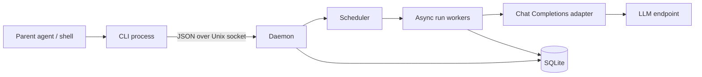

# Asyntalc prototype plan

Status: Proposed implementation plan, 2026-09-19.
Based on [the v0.1 design](asyntalc-design-v0.1.md).
Provider decision: an OpenAI-compatible Chat Completions API, with configurable endpoint and model.

The first prototype should prove that a parent can submit several tasks, exit, and later retrieve durable results. Build one Rust binary with a short-lived client and a separately started daemon. Add parent clarification after the basic request lifecycle works; add workspace tools and isolation afterward.

The parent owns decomposition, dependencies, and synthesis. The daemon owns execution, concurrency, conversation state, and recovery. This is enough to support a parent-managed swarm without implementing an autonomous swarm planner.

## 1. Review decisions

The existing design has the right boundaries. Resolve these details before implementation:

| Topic | Prototype decision |
|---|---|
| Durability | Acknowledge submission only after committing the run and event to SQLite. |
| Session creation | `submit` creates a missing named session atomically; omitting `--session` creates an independent session. Return its ID. |
| Existing session configuration | Reuse its stored model/profile; reject conflicting overrides rather than silently changing its context. |
| Conversation ordering | Persist prompts at submission, but add them to model context only when their run starts. Future queued prompts must not leak into earlier runs. |
| Waiting for parent | Retain the session's head run, release the global execution slot, and block later runs in that session. |
| Resume | Keep the same run ID and original FIFO position. Require a question ID so stale answers cannot resume a newer question. |
| Completion | Means the executor obtained a valid final answer; it does not prove that the answer is correct or the user's objective is met. |
| Client output | Versioned JSON receipts and snapshots; detailed conversation history is opt-in. |
| Daemon startup | Explicit foreground `daemon` command initially. Defer automatic launch and service installation. |
| Restart | Recover queued and waiting runs; fail previously running runs with `daemon_interrupted`. Do not automatically replay their API requests. |
| Streaming | Start with non-streaming provider responses and snapshot waits. Async execution does not require token streaming. |
| Workspace | No file or command tools in the initial slice. Later, require a caller-supplied workspace per session. |

## 2. Scope and architecture



The CLI reads input, sends one request, prints a response, and exits. It never calls the model directly. Separate CLI invocations share the daemon's durable state.

Use a single crate. Suggested modules: `cli`, `protocol`, `daemon`, `scheduler`, `store`, `provider`, `runner`, and `error`. Add `tool` and `sandbox` only when those slices begin.

Use Tokio for socket handling and concurrent model requests. Keep scheduler ownership in one task with bounded messages; avoid holding shared locks across network waits. Tokio documents this resource-owner/channel pattern in its [channel tutorial](https://tokio.rs/tokio/tutorial/channels).

Keep SQLite access behind a store interface and a dedicated database worker if using a synchronous driver. Keep transactions short and never hold one open during an LLM request. WAL can support concurrent readers, but SQLite still permits only one writer, as described in its [transaction documentation](https://www.sqlite.org/lang_transaction.html) and [WAL documentation](https://www.sqlite.org/wal.html).

Use one OS-level exclusive lock per data directory, a private socket accessible to its owner, bounded request frames, and bounded queues. Reject excess submissions with a typed capacity error. Configure input, response, history, and event-size limits from the beginning.

## 3. CLI workflow

The examples below specify planned commands; no executable exists yet.

```bash
# Terminal 1: daemon owns API credentials and provider configuration.
asyntalc daemon --config daemon.toml

# Terminal 2: each submission returns after its database commit.
asyntalc submit --session api-review --input api-task.md --output json
asyntalc submit --session storage-review --input storage-task.md --output json

# Inspect immediately or wait for a useful outcome.
asyntalc status --run run_a --output json
asyntalc wait --run run_a --timeout 20s --output json
asyntalc result --run run_a --output text

# Parent interaction, introduced in milestone 4.
asyntalc resume --run run_a --question q_1 --input answer.md --output json
asyntalc cancel --run run_a --output json
```

Support stdin through `--input -`. Make JSON the prototype default; `--output text` is explicit. Diagnostics belong on stderr. Use the existing document's `asyntalc` spelling consistently until a separate naming decision is made.

`wait` blocks only the invocation that calls it, for a bounded time. The daemon continues all eligible runs. Even a host that invokes CLI tools sequentially can submit A, submit B, do local work, and then wait; A and B overlap in the daemon. The host must choose when to wait—this executable cannot force the parent model to continue reasoning while its host blocks on a tool.

Add `runs list --status ...` with pagination to rediscover handles after a parent restart. Add `logs --run ... --after-seq ... --limit ...` for finite event retrieval. Defer live JSONL streaming and `send` convenience mode until the core works.

For larger swarms, the next interface extension should be bounded `wait --any --runs ...`, so one slow run does not delay noticing another run's question or completion. It is not required for the first two-run demonstration.

## 4. What the async client returns

Return an executor-created envelope. The model supplies answer text and tool arguments; it never controls IDs, lifecycle state, command success, or reported execution facts.

### Submission receipt

```json
{
  "protocol_version": 1,
  "request_id": "req_1",
  "ok": true,
  "run_id": "run_a",
  "session_id": "api-review",
  "status": "queued",
  "revision": 1
}
```

This is a committed acceptance receipt, not an LLM response. It must not wait for a provider connection. `queued` describes the committed receipt; the scheduler may already have started execution when the caller reads it.

### Wait/status snapshot

```json
{
  "protocol_version": 1,
  "request_id": "req_2",
  "ok": true,
  "run_id": "run_a",
  "session_id": "api-review",
  "status": "running",
  "revision": 2,
  "return_reason": "wait_timeout",
  "phase": "model_request",
  "progress": null,
  "cancellation_requested": false,
  "blocked_by_run_id": null,
  "created_at": "2026-09-19T03:00:00Z",
  "started_at": "2026-09-19T03:00:01Z",
  "finished_at": null,
  "result": null,
  "input_request": null,
  "run_error": null,
  "usage": {"model_requests": 1, "input_tokens": null, "output_tokens": null}
}
```

`return_reason` describes why this command returned: `snapshot`, `terminal`, `input_required`, or `wait_timeout`. It is separate from durable run status. A timeout here leaves the run unchanged.

`revision` increases on observable durable changes. Progress is optional and advisory: without streaming or tools, the daemon knows only that an API request is in flight. Do not invent percentages or claim the model is reasoning or making progress.

`status` omits answer bodies by default; `wait` includes a bounded final answer on terminal return. Both include `result` metadata if a result exists. `result --output text` retrieves the full stored answer; before completion it returns `result_not_ready`.

### Terminal result

On completion, the same snapshot has `status: "completed"`, `return_reason: "terminal"`, a finish timestamp, and:

```json
{
  "result": {
    "format": "text",
    "text": "Use one FIFO queue per session and allow independent sessions to run concurrently.",
    "truncated": false,
    "full_result_available": true,
    "finish_reason": "stop"
  },
  "input_request": null,
  "run_error": null
}
```

Initially store the full bounded provider answer in SQLite. Limit inline answer text to a proposed 16 KiB UTF-8-safe prefix; set `truncated: true` when shortened. The full answer remains accessible using the run ID. Cap total provider response size independently and fail explicitly if exceeded. Add artifact references when file/tool output exists.

Return the useful final answer, not every internal conversation message. A second model call just to summarize the result is unnecessary. If a task asks for findings, evidence, and limitations, request those in its prompt; they remain model-authored claims, not executor guarantees. Schema-validated structured task results can be an optional later feature.

### Parent input

For `waiting_for_parent`, return `return_reason: "input_required"` and:

```json
{
  "input_request": {
    "question_id": "q_1",
    "kind": "question",
    "prompt": "Should this proposal preserve the existing public CLI?",
    "choices": ["preserve", "redesign"],
    "allows_free_text": true
  }
}
```

The question ID belongs to the daemon. Resume validates that ID and stores the answer atomically before making the same run eligible again. Repeating the identical answer to the same question returns the prior acknowledgement; a different answer conflicts. A clarification response is not a general authorization mechanism for future privileged tools.

### Failures and exit codes

A successfully queried failed run has `ok: true`, `status: "failed"`, and a typed `run_error`, for example `{"code":"provider_auth_error","message":"Provider rejected authentication"}`. Keep partial text, if any, explicitly separate from the final result.

A command failure has `ok: false` and `error`, for example `{"code":"run_not_found","message":"Unknown run ID"}`. Do not expose API keys or raw provider headers/bodies in errors.

Use exit code 0 for valid receipts and snapshots, including failed runs, input requests, and wait timeouts. Use 2 for invalid CLI arguments and 1 for transport/protocol/command errors. Scripts inspect `status` for task success. Client interruption exits nonzero without cancelling the run. This keeps command execution distinct from task execution.

## 5. OpenAI-compatible adapter

Define a provider profile containing an API base URL (including its version prefix), model, API-key environment variable name, request timeout, instruction role, and supported capabilities. Append `/chat/completions` once. Resolve credentials inside the daemon; persist only the profile reference and non-secret effective configuration.

Implement a small HTTP adapter using `model`, `messages`, and `stream: false`; request one choice. Decode assistant text, tool calls, finish reason, and optional usage. Chat Completions represents function calls on assistant messages and returns tool results using the matching `tool_call_id`. See the [official Chat API reference](https://developers.openai.com/api/reference/resources/chat).

Treat this as an explicit compatibility profile, not a promise that every similarly named API works identically. Avoid sending optional fields indiscriminately. Output-token parameter names, instruction roles, tool support, usage, and optional fields must be configurable or verified against the chosen endpoint. Text-only operation should work without function calling.

For the prototype, map a valid final text answer with `stop` to completion. Map `length` to `output_limit`, filtered/refused output to a typed unsuccessful outcome, malformed responses to `provider_protocol_error`, and unsupported tool calls to `unsupported_capability`. Preserve the provider finish reason. Never interpret HTTP 200 alone as task completion.

Use a fake HTTP provider for deterministic tests and one explicit live smoke test against a user-configured model. No credentials are needed for normal tests. Keep automatic API retries off initially; ambiguous network failures become visible failures rather than hidden duplicate calls. Parent retry is an explicit new run. Local submission deduplication does not imply provider-side exactly-once execution.

Later streaming is an adapter enhancement; it must not change the CLI lifecycle contract.

## 6. Durable scheduler rules

Use four initial tables: `sessions`, `runs`, `messages`, and `events`. Add artifacts only when needed. Store input, immutable session queue position, status/revision, timestamps, deadline, result/error, cancellation request, pending question, and optional submission idempotency key on each run. Give messages stable ordering and distinguish run-local history from history committed for future runs.

Each state transition, revision increment, and corresponding event belongs in one transaction. Use a monotonic per-run event sequence for paginated logs. Publish in-memory notifications only after commit; notifications are hints, SQLite is authoritative.

Submission with `--idempotency-key` deduplicates within the daemon data directory. Persist the key, request fingerprint, and original receipt in the submission transaction. The same key and payload return that receipt; a changed payload returns a conflict. Keep the key while retaining the run. A parent uncertain whether submission succeeded can retry safely using the same key.

Schedule the earliest nonterminal run per session, subject to a configurable global active-run limit. Default to two workers for the demonstration and round-robin eligible sessions. A waiting head run blocks its own session, not other sessions. Return its ID as `blocked_by_run_id` on queued snapshots.

Maintain run-local messages during execution and clarification. Commit their conversation segment to the session only on successful completion. Failed/cancelled/timed-out runs retain their audit history but do not append incomplete tool-call sequences to later model context. Subsequent runs see the last successfully committed context. Document this policy; explicit retry can include useful partial information.

Implement `wait` as subscribe, read durable snapshot, evaluate, then await notification and re-read until terminal/input-required/timeout. This avoids a completion lost between inspection and subscription. Do not hold a database transaction or worker permit while long-polling. Multiple waiters must work independently.

Persist an absolute run deadline, proposed default 10 minutes from submission. It includes queue and parent-input time, and is distinct from the HTTP request timeout and client wait timeout. Check expired deadlines in all nonterminal states, including during startup. Extend the original lifecycle diagram with `queued -> timed_out` and `waiting_for_parent -> timed_out`.

For cancellation, atomically record the request and notify the worker. Queued/waiting runs can become cancelled immediately. Active workers drop the local HTTP future and finish cleanup; remote generation or billing may continue. A completion commit and cancellation request must be serialized: if completion commits first, cancel returns the unchanged terminal state; if cancellation commits first, discard a late completion and terminalize cancellation. Use the same single-winner discipline for deadlines.

On restart, keep queued and unexpired waiting runs, finalize persisted cancellation requests, and fail other previously running runs with `daemon_interrupted`. Successful committed results remain successful even if their original CLI never received a reply. The ownership lock prevents a second scheduler from running against the same directory.

## 7. Parent clarification without a sandbox

After the text-only slice, expose one control tool: `ask_parent({prompt, choices?})`. Validate arguments, persist the assistant tool call and question, and suspend the run. On resume, append the parent's answer as that call's tool result before requesting another model turn. This follows the tool-call/result relationship in the [official function-calling guide](https://developers.openai.com/api/docs/guides/function-calling).

Require tool-call support only for this milestone. Ask for one tool call per turn where supported and enforce the constraint locally; reject multiple calls explicitly in this prototype. Do not infer suspension by parsing ordinary prose that ends in a question mark.

Bound model turns, question count, context size, and output size. Fail with typed limit errors when exhausted. Initially reject oversized conversation context rather than silently summarizing or dropping earlier messages.

## 8. Implementation milestones and acceptance tests

| Milestone | Deliverable | Acceptance evidence |
|---|---|---|
| 1. Client/daemon contract | Socket framing, CLI JSON, exclusive daemon ownership, SQLite migrations, fake runner | Another process retrieves a committed run; duplicate daemon refused; malformed/oversized request rejected; stdout parses as JSON. |
| 2. Real text requests | Configurable Chat adapter, result persistence, status/wait/result | Fake HTTP contract tests plus one live smoke request; closing submit client does not stop work; another CLI retrieves the exact final text. |
| 3. Concurrent durable execution | Session FIFO, global limit, idempotency, cancellation, deadlines, restart | Two sessions overlap; same-session runs do not overlap or see future input; ambiguous submit retry deduplicates; cancellation/deadline wins cannot be overwritten. |
| 4. Parent interaction | `ask_parent`, resume, persisted questions | Wait returns a question; waiting A1 blocks A2 while B runs; restart retains question; answer resumes A1; duplicate/stale answers are handled deterministically. |
| 5. Operable prototype | Paginated list/logs, bounded output, failure documentation, end-to-end demo | Multiple waiters and timeout/completion races pass; queued work recovers; running work fails visibly after kill/restart; completed results survive a lost reply. |

Use deterministic barriers and a delayed fake provider to test concurrency rather than relying on wall-clock timing alone. Include authentication errors, rate limits, malformed JSON, missing usage, output truncation, provider disconnect, and context limits in adapter tests. Check that unavailable token usage remains `null`, not a misleading zero.

For one developer comfortable with async Rust, a rough planning allowance is 2–4 focused days for milestones 1–2 and another 4–8 days for milestones 3–5. This is an estimate, not a delivery promise; provider quirks and crash/race handling dominate uncertainty. Tool execution and Docker are a separate estimate and milestone.

## 9. What follows the prototype

Add workspace reads and search, then sandboxed commands with explicit policies, output limits, process cleanup, and tests of the actual isolation boundary. Keep credentials in the daemon. Concurrent coding sessions need caller-managed separate directories or worktrees before shared-file mutation is enabled.

Then consider wait-any, structured result schemas, provider streaming, additional adapters, artifacts, and retention. Defer automatic delegation, DAG scheduling, multi-host operation, MCP integration, and transparent interrupted-request replay until the basic lifecycle has proven useful.

The first end-to-end demonstration is: submit A and B, exit both clients, observe concurrent execution, receive and answer a question from A, collect both final answers, and verify that a daemon interruption produces explicit recoverable state rather than silent duplication.
